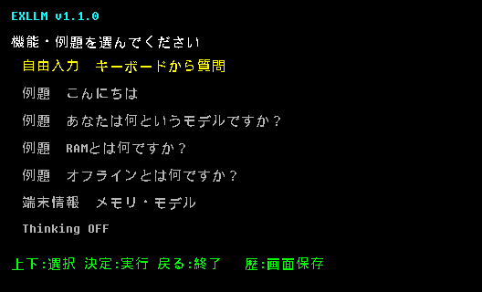
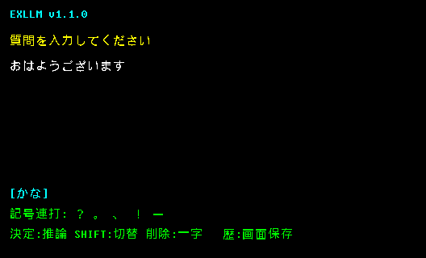
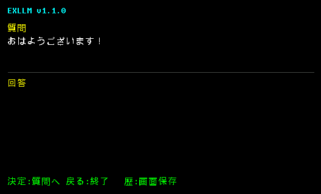

# EXLLM for EX-word

日本語 | [English](#english)

EXLLM for EX-wordは、小型日本語LLM「EXLLM 5M」をCASIO EX-word上でオフライン実行するhomebrewアプリです。XD-B4800（DATAPLUS 6）実機で、キーボード入力から回答生成まで確認しています。

LLMとは、Little Language Modelの略です。

現行版は`v1.1.0`です。Thinking ONで生成したdraft tokenを最終推論へ再利用する修正を収録しています。

## 対応環境

[`exword-template`](https://github.com/brain-hackers/exword-template)とlibexwordの対応範囲から、DATAPLUS 5 / 6 / 7を理論上の対象としています。実機で起動・キー入力・推論・ベンチマークを確認したのはXD-B4800（DATAPLUS 6）のみです。他機種での動作は保証せず、DATAPLUS 5 / 7およびそれ以外の世代は実機未確認です。

## 収録アプリ

- `XLLMI` — 通常利用向け安定版
- `XLMBM` — TTFT・総時間・tokens/sを記録する計測版

電子辞書用`model.q12`は[`ToTo-40417/EXLLM`](https://huggingface.co/ToTo-40417/EXLLM/tree/main/weights)で配布しています。端末ではダウンロードした`model.q12`を本体内蔵領域の`MODELS/model.q12`へ配置します。モデルのソースと学習手順は[`exllm`](https://github.com/ToTo-40417/exllm)を参照してください。

`model.q12`は、モデルrepoの`python tools/export_exq12.py`で公開EXLLM8重みから同一SHA-256のファイルを再生成できます。

## 実機結果

XD-B4800の5回測定では、Thinking OFF時のTTFT中央値は23.711秒、TTFT後の生成速度は0.52〜0.55 token/秒でした。詳細は[`docs/EXLLM-BENCHMARK-ARTICLE-NOTES.md`](docs/EXLLM-BENCHMARK-ARTICLE-NOTES.md)を参照してください。

Thinking ONでは最大10 tokenのdraftを先に生成し、そのtoken列を`元の質問 + "\n回答:" + draft`という単一USER入力へ直接組み込んで再prefillします。draftはEOSまたは文末記号で早期終了し、最終回答にはThinking OFFと同じ最大48 tokenを確保します。128 tokenのcontextを超える場合は、最終回答、draft、元質問の順で領域を優先し、必要な分だけ元質問の左側を省略します。

## 操作方法

### 1. 機能または例題を選ぶ



`EXLLM`を起動するとメニューが表示されます。上下キーで項目を選び、「決定」で実行します。

- `自由入力`：本体キーボードから質問を入力
- `例題`：収録済みの4問をそのまま実行
- `端末情報`：モデル容量、KV cache、連続メモリ、本体識別情報を表示
- `Thinking ON/OFF`：「決定」で切り替え。初期値はOFF
- `戻る`：アプリを終了
- `履歴`：表示中の画面を保存

### 2. キーボードから質問する



自由入力はローマ字入力のかな変換から始まります。例えば`OHAYOU`と入力すると「おはよう」になります。

| キー | 動作 |
|---|---|
| 文字キー | かなまたは英字を入力 |
| `SHIFT` | `かな` / `ABC`を切り替え |
| `記号` | `？ 。 、 ！ ー`を順に切り替え |
| 右方向キー | 空白を入力 |
| `削除` | 末尾の1文字を削除 |
| `決定` | 入力した質問で推論開始 |
| `戻る` | 入力を中止してメニューへ戻る |
| `履歴` | 表示中の画面を保存 |

### 3. 回答を確認する



推論中は生成されたトークンが順次表示され、完了後も質問と回答が上下に分かれて残ります。上のGIFは実機スクリーンショットを用い、実測した0.52〜0.55 token/秒の表示間隔を30秒で再現しています。「決定」で次の質問へ戻り、「戻る」で終了します。

「履歴」を押すと、表示中の528×320画面を日時付きBMPとして本体内蔵領域の`XLLMI/_USER/YYYYMMDD/`へ追加保存します。画像はUSB接続時にlibexwordから回収できます。

## ビルド

devkitSH4と[`libdataplus`](https://github.com/brijohn/libdataplus)が必要です。依存物はこのrepoに同梱していないため、それぞれの配布元から取得してください。

```bash
export DEVKITPRO="$HOME/toolchains/devkitPro"
export DEVKITSH4="$DEVKITPRO/devkitSH4"
export PATH="$DEVKITPRO/tools/bin:$DEVKITSH4/bin:$PATH"
make -C apps/exllm
make -C apps/exllm-benchmark
```

ビルド済みD01ではなくソースを公開しています。必要な依存物は上流repoから直接取得してビルドしてください。インストール中はUSBを切断しないでください。

## ライセンス

GPL-2.0。Gnuboy EX由来の最小libcと[`brain-hackers/exword-template`](https://github.com/brain-hackers/exword-template)を基礎にしています。モデルはApache-2.0で別配布です。ゲームROM、セーブデータ、CASIO firmware、端末認証情報は含みません。再配布や派生版の公開はライセンスに従って自由に行えますが、活用状況を把握するため、公開時に作者へ一報いただけると幸いです（連絡は利用条件ではありません）。

## 関連プロジェクト

- [`EXLLM`](https://github.com/ToTo-40417/exllm) — 学習・評価コードと参照ランタイム
- [Hugging Faceモデル・配布用重み](https://huggingface.co/ToTo-40417/EXLLM)
- [`exword-hardware-dump`](https://github.com/ToTo-40417/exword-hardware-dump) — EX-word実機情報の取得
- [`exword-gnuboy-save-importer`](https://github.com/ToTo-40417/exword-gnuboy-save-importer) — Gnuboyセーブデータ転送
- [Note記事：高校生用の電子辞書でLLMを動かしてみた ―0.024GHz/0.016GB](https://note.com/joyful_beetle869/n/nbd1e26679b78)

## English

EXLLM for EX-word runs the EXLLM 5M Japanese language model fully offline on CASIO EX-word hardware. Keyboard input and token-by-token generation have been verified on an XD-B4800 (DATAPLUS 6).

Here, LLM stands for Little Language Model.

The current version is `v1.1.0`, including the fix that feeds Thinking-mode draft tokens into the final inference pass.

### Compatibility

Based on the supported scope of [`exword-template`](https://github.com/brain-hackers/exword-template) and the libexword installation path, DATAPLUS 5, 6, and 7 are theoretical targets. Boot, keyboard input, inference, and benchmark operation have been tested only on an XD-B4800 (DATAPLUS 6). Other models are not guaranteed; DATAPLUS 5, DATAPLUS 7, and all other generations remain untested on physical hardware.

This repository contains the stable `XLLMI` app and the separate `XLMBM` benchmark build. The device-ready [`model.q12`](https://huggingface.co/ToTo-40417/EXLLM/tree/main/weights) is distributed on Hugging Face; place it at `MODELS/model.q12` in the device's internal storage. Model source and training instructions are available in [`exllm`](https://github.com/ToTo-40417/exllm). On the physical device, median TTFT was 23.711 seconds and post-TTFT generation was 0.52–0.55 token/s with Thinking disabled.

The model repository's `python tools/export_exq12.py` deterministically rebuilds `model.q12` from the published EXLLM8 weights and verifies the release SHA-256.

With Thinking enabled, the runtime generates a draft of up to 10 tokens and reuses those exact token IDs in a second single-turn USER prompt: `original question + "\n回答:" + draft`. EOS and sentence-ending punctuation may stop the draft early. The final pass keeps the same 48-token generation limit as normal mode. Within the fixed 128-token context, final-answer space takes priority, followed by the draft; the left side of an overlong original question is trimmed only when required.

### Operation


Use Up/Down to select free input, one of four example questions, device information, or `Thinking ON/OFF`, then press Enter. Thinking defaults to OFF. Back exits the application, and History saves the currently displayed screen.


Free input starts in romaji-to-kana mode. Letter keys enter text; Shift switches between kana and `ABC`; repeated Symbol presses cycle through `？ 。 、 ！ ー`; Right inserts a space; Delete removes one character; Enter starts inference; and Back cancels input.


Generated tokens appear progressively. The GIF above uses a physical-device screenshot and reproduces the measured 0.52–0.55 token/s display interval in 30 seconds. The completed screen keeps the question above the divider and the answer below it. Enter returns to the next question and Back exits. History stores a timestamped 528×320 BMP under `XLLMI/_USER/YYYYMMDD/` in internal storage; screenshots can be retrieved over USB with libexword.

devkitSH4 and [`libdataplus`](https://github.com/brijohn/libdataplus) are required but not bundled. Obtain each dependency directly from its upstream repository and build the apps from source. Do not disconnect USB while installing.

GPL-2.0 source. The Apache-2.0 model, game ROMs, save data, CASIO firmware, and device authentication data are not included. Redistribution and derivative releases are welcome under the license. If you publish one, a brief note to the author would be appreciated, but is not a condition of use.

Related projects: [`EXLLM`](https://github.com/ToTo-40417/exllm), [`EXLLM on Hugging Face`](https://huggingface.co/ToTo-40417/EXLLM), [`exword-hardware-dump`](https://github.com/ToTo-40417/exword-hardware-dump), and [`exword-gnuboy-save-importer`](https://github.com/ToTo-40417/exword-gnuboy-save-importer). See also the Japanese Note article, “[高校生用の電子辞書でLLMを動かしてみた ―0.024GHz/0.016GB](https://note.com/joyful_beetle869/n/nbd1e26679b78).”
